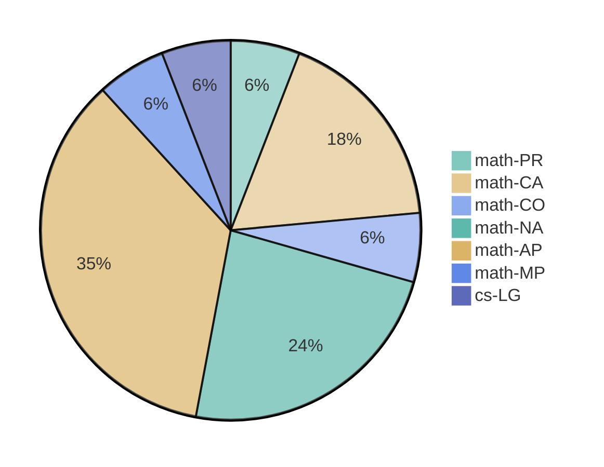

> This latent seminar is purely for personal interests, and it is inspired by John Baez's weekly findings and Terry Tao's blog, which I followed since I was an undergraduate student.  I found it fascinating to learn from a wide variety of topics.  I used to keep a research blog (updated to 2020) to document some trivial thoughts, but unfortunately paused during COVID-19.  Now, it is resumed in a different form.
> 
> The topics are quite random but enjoyable!

## 📊 Tag Distribution

